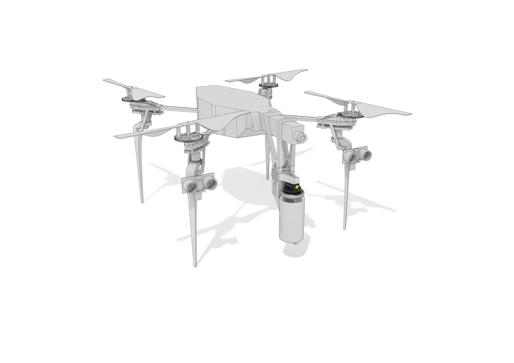

# Graffiti drone

Tag your favorite (legal) wall with via drone. 

Essentially the Graffiti Drone project is the following:

[GML files](http://www.graffitimarkuplanguage.com/) -> Graffiti Drone -> [Parrot AR Drone 2.0](http://ardrone2.parrot.com/) + Arduino -> Tagged wall

**Warning:** this is still under active development and not everything is completed yet. The flight control is still a bit wonky. Suggestions and feedback are welcome as we finish building and testing...

## Getting started

1. Build your Arduino circuits
2. Print the parts for the drone
3. Setup your Parrot AR Drone 2.0
4. Install the gem
5. Get taggin'

## Arduino

We are using a [Wifi Redback](http://store.linksprite.com/wifi-redback-1-0-arduino-yellowjacket-compatible/) for this setup.

Hardware list:

1. Wifi Redback Yellowjacket compatible Arduino (with USB breakout board to program like the FT232RL)
2. 2 distance sensors (HC-SR04)
3. DC/DC converter (TSR 1-2450) for Redback
4. Custom cable of mini-Tamiya female to split female / raw wires (**mini-Tamiya out of the Parrot AR Drone battery is flipped**)

Solenoid circuit hardware list (with suggestions): 

1. Solenoid (HCNE1-0520) - may be able to find something better for the power/weight tradeoff 
2. Diode (1N4004)
3. Resistor (2.2 kohm)
4. MOSFET transistor (IRLZ44)

The [circuit layout](schematics/graffiti-drone.fzz) can be found in the project under the `schematics` directory.

Steps for Arudino software:

1. Download the [wifi server code](https://github.com/linksprite/ZG2100BasedWiFiShield/zipball/master) and rename as 'CuHead' in your Arduino libraries area
2. Download NewPing library to your Arduino libraries area
3. Update the [`sketches/GraffitiDroneWiServer.ino` sketch](sketches/GraffitiDroneWiServer/GraffitiDroneWiServer.ino) with your wifi hotspot information
4. Compile and upload

Tips and warnings:

* If you don't flip the polarity of the mini-Tamiya coming out of the Parrot AR battery you will blow your diode in the circuit!
* `Arduino Nano w/ ATmega 3281` should be the board selected in the Arduino IDE or you will get an avrdude error when uploading
* Make sure your `CuHead/apps-conf.h` has `APP_WISERVER` uncommented (and the rest commented out)
* Don't attach anything to pins 9-13 of the Redback since that is used for wifi

## Parrot AR Drone

We are using the Parrot AR Drone 2.0 for this project. If you want it to work with a different drone you should replace the `argus` gem with something else and update the GraffitiDrone.rb class to use it.

Update the drone so it will [connect to your wifi network](https://gist.github.com/karlwestin/4051467). You will need to do this every time you unplug the drone since the default settings are restored on startup.

You may want to consider getting a high amperage battery for the drone too to extend flight time and offset the power draw of the Arduino and solenoid.

## 3D printed parts

We use a 3D printer for the various pieces that extend and replace the body of the drone. See the `3d-models` directory for the 3D Rhino and STL files for the additonal parts.

The AR Drone will look like the following with the new parts:

## Spray can

We use the [Montana Micro 30 ml spray can](http://www.montanacolors.com/webapp/spray?id=1). You will need to adjust the 3D model if you use something else.

## Software setup

Simple:

`install gem graffiti_drone`

## Running it

Place the drone near a wall (within a foot or two) and run the following command:

`graffiti tag FILE`

`FILE` is the GML file you want the drone to tag.

Console output will keep you up to date on what the drone is trying to do.

## Tests

There are some very limited `rspec` tests that have been added for a few of the modules, but more are needed. 

## Todo

If you want to contribute here are some ideas that we have had that would make the process even better:

* Configurable starting point and size mapping for tags
* Better system for understanding current position on wall (maybe computer vision based?)
* Stencil mode
* Actual PIDs for adjustment of wall distance and yaw

There are also a bunch of places in the code with `TODO` marked for changes and improvements.

## Contributing

1. Fork it ( https://github.com/chrizbo/graffiti_drone/fork )
2. Create your feature branch (`git checkout -b my-new-feature`)
3. Commit your changes (`git commit -am 'Add some feature'`)
4. Push to the branch (`git push origin my-new-feature`)
5. Create a new Pull Request

## License

Code released under the MIT license.

## Contributors

[Chris Butler](http://github.com/chrizbo), [Jason Dembsiky](http://jasondembski.com), [Jon Phillips](http://github.com/rejoin)
